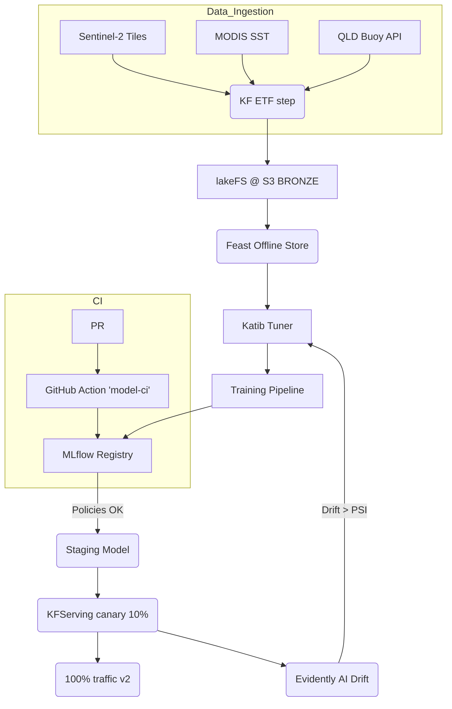

# ReefGuard AI – Continuous Coral‑Bleaching MLOps Pipeline

## Table of Contents

1. [Project Overview](#project-overview)
2. [Prerequisites](#prerequisites)
3. [End‑to‑End Workflow Diagram](#end-to-end-workflow-diagram)
4. [Core Competencies & How They’re Demonstrated](#core-competencies--how-theyre-demonstrated)
5. [Tech Stack](#tech-stack)
6. [Data Sources](#data-sources)
7. [Repository Structure](#repository-structure)
8. [Local Development Quick‑Start](#local-development-quick-start)
9. [Example Commands](#example-commands)
10. [Infrastructure‑as‑Code](#infrastructure-as-code)
11. [Data & Feature Management](#data--feature-management)
12. [Automated Training & Tuning](#automated-training--tuning)
13. [Model Registry & Promotion Workflow](#model-registry--promotion-workflow)
14. [CI/CD Pipelines](#cicd-pipelines)
15. [Model Serving & Deployment Strategies](#model-serving--deployment-strategies)
16. [Monitoring & Observability](#monitoring--observability)
17. [Cost Optimisation](#cost-optimisation)
18. [Troubleshooting & FAQ](#troubleshooting--faq)
19. [Stretch Goals](#stretch-goals)
20. [References](#references)

---

## Project Overview

**ReefGuard AI** is a fully‑automated MLOps platform that predicts coral‑bleaching risk for the Great Barrier Reef by ingesting live MODIS/Sentinel‑2 sea‑surface‑temperature imagery and Queensland buoy sensor streams, materialising features in Feast, training an XGBoost + Vision Transformer ensemble via Kubeflow Pipelines and Katib tuning, registering models in MLflow with GitHub‑gated promotion, and rolling canary deployments to KFServing (or AWS SageMaker Serverless GPU) with Istio traffic splitting.  Evidently AI monitors data & prediction drift, triggering auto‑re‑training jobs and Slack alerts.  All infra is codified with Terraform and Helm; CI/CD runs through GitHub Actions.  Idle cost ≈ AUD 20/month.

**Key capabilities**

- Near‑real‑time ingestion of satellite and buoy observations.
- Feature materialisation and online serving via Feast.
- Automated training and hyper‑parameter tuning with Kubeflow Pipelines and Katib.
- Experiment tracking and model registry powered by MLflow.
- Canary or serverless GPU deployment through KFServing or SageMaker.
- Continuous drift monitoring with Evidently AI and automated retraining triggers.

## Prerequisites

The project assumes the following tools are installed locally:

- [Python 3.10+](https://www.python.org/)
- [Docker](https://www.docker.com/) and [Docker Compose](https://docs.docker.com/compose/)
- [kubectl](https://kubernetes.io/docs/tasks/tools/) and [Helm](https://helm.sh/) for interacting with Kubernetes clusters
- [Terraform](https://www.terraform.io/) for infrastructure provisioning
- Optional: [conda](https://docs.conda.io/) for environment management

---

## End‑to‑End Workflow Diagram



---

## Core Competencies & How They’re Demonstrated

| Competency                    | ReefGuard AI Component                                                                                                                                          |
| ----------------------------- | --------------------------------------------------------------------------------------------------------------------------------------------------------------- |
| Data Versioning & Lineage     | **lakeFS** branching on S3 for raw + Parquet layers; tracked in LakeFS console                                                                                  |
| Feature Store                 | **Feast** offline (Parquet on S3) & Redis online store                                                                                                          |
| Experiment Tracking           | **MLflow** tracking server & UI with autologging                                                                                                                |
| Hyper‑Parameter Tuning        | **Katib** Bayesian optimisation in Kubeflow                                                                                                                     |
| Orchestration                 | **Kubeflow Pipelines** (v2 DAG using KFP SDK 2)                                                                                                                 |
| CI/CD for ML                  | GitHub Actions workflow (`model‑ci.yml`) runs unit tests, builds Docker image, validates model metrics via Evidently test suite, and bumps Helm chart image tag |
| Model Registry & Promo Policy | MLflow model registry with staging/production stages enforced via GitHub required check                                                                         |
| Secure Serving & Canary       | **KFServing** GPU‑enabled InferenceService with **Istio** VirtualService splitting 10 % traffic to candidate model                                              |
| Monitoring & Drift            | **Evidently AI** service publishes PSI & KS stats to **Prometheus** ➜ Grafana; SLO alert triggers Katib retrain pipeline                                        |
| Infra as Code                 | **Terraform 1.7** modules for EKS, S3, SageMaker; **Helmfile** & **Kustomize** overlays for cluster resources                                                   |
| FinOps                        | Spot training instances, S3 intelligent‑tiering, Serverless GPU endpoint auto‑pause, `terraform‑cost‑estimation` check in CI                                    |

---

## Tech Stack

| Layer                          | Tools/Services                                           |
| ------------------------------ | -------------------------------------------------------- |
| Object Storage & Data Lake     | S3 + lakeFS                                              |
| Orchestration                  | Kubeflow Pipelines 2.0 on EKS                            |
| Feature Store                  | Feast v0.40 (Redis + Parquet)                            |
| Training & Tuning              | Katib, PyTorch 2.2, XGBoost 2                            |
| Experiment Tracking & Registry | MLflow 2.12                                              |
| Model Serving                  | KFServing v1.2 GPU or AWS SageMaker Serverless Inference |
| Monitoring                     | Evidently Service, Prometheus 2.51, Grafana 11           |
| CI/CD                          | GitHub Actions, Docker Buildx, ArgoCD optional           |
| IaC                            | Terraform 1.7, Helmfile, Kustomize                       |

---

## Data Sources

| Source                        | Format    | Frequency       | Access               |
| ----------------------------- | --------- | --------------- | -------------------- |
| Sentinel‑2 L2A surface‑temp   | COG       | Daily tiles     | AWS Open Data Bucket |
| MODIS Sea‑Surface Temperature | HDF       | Daily composite | NASA OPeNDAP         |
| Queensland IMOS buoys         | JSON REST | Every 10 min    | AIMS Weather API (API key) |

---

## Repository Structure

```
reefguard-ai/
├── data/
│   ├── lakefs-repo/            # not committed – pointer
├── infra/
│   ├── terraform/
│   │   ├── core/               # VPC, EKS, S3, IAM, SageMaker
│   │   └── mlops/              # KFServing, ALB, Grafana
│   └── helmfile/               # MLflow, Feast, Evidently charts
├── pipelines/
│   └── kfp_v2/
│       ├── etl_pipeline.py
│       ├── training_pipeline.py
│       └── retrain_on_drift.py
├── features/
│   ├── feature_repo.yaml
│   └── sst_features.py
├── models/
│   ├── trainer/
│   │   ├── train.py
│   │   └── model.py
│   └── inference/
│       ├── predictor.py
│       └── Dockerfile
├── serving/
│   └── inference_service.yaml   # KFServing CRD
├── .github/workflows/
│   ├── model-ci.yml
│   └── infra-plan.yml
└── docs/
    ├── architecture.drawio
    ├── grafana_dash.json
    └── demo_script.md
```

---

## Local Development Quick‑Start

Install [pre-commit](https://pre-commit.com/) hooks to automatically format and
lint code (Black, isort, Flake8) before each commit.

```bash
# Clone & prep
conda create -n reefguard python=3.11 -y && conda activate reefguard
pip install -r requirements.txt -r requirements-dev.txt
pre-commit install
pre-commit run --all-files

# Start MLflow & Feast locally
mlflow server --backend-store-uri sqlite:///mlflow.db --default-artifact-root ./mlruns &
feast apply

# Run a tiny sample pipeline
python pipelines/kfp_v2/etl_pipeline.py --local-sample
python models/trainer/train.py --sample-data
```

## Example Commands

```bash
# Run tests
pytest -q

# Build training image
docker build -t reefguard/trainer models/trainer

# Trigger a sample training run
python models/trainer/train.py --sample-data

# Serve the latest model locally
python models/inference/app.py --model-path models/artifacts/latest
```

---

## Infrastructure‑as‑Code

* **Terraform root modules**: `core` (network, EKS, S3, IAM) and `mlops` (ECR, SageMaker, Prometheus, ALB Ingress).
* **Helmfile** manages Kubernetes releases: MLflow, Feast, Evidently, KFServing CRDs. Helm values for MLflow live under `helm/mlflow/values.yaml`.
* **lakeFS installation** via Helm with S3 backend.

Example deploy:

```bash
cd infra/terraform/core
terraform init -backend-config="profile=reefguard"
terraform apply -auto-approve

cd ../mlops
terraform init && terraform apply -var-file=main.tfvars

helmfile -f ../helmfile/01_core.yaml apply
```

---

## Data & Feature Management

1. **lakeFS** branches per experiment (`lakefs checkout -b exp/katib‑run‑42`).
2. **Feast** feature definitions (`sst_rolling_avg`, `turbidity_zscore`) materialised hourly to Parquet offline store; Redis online TTL = 8 h.
3. Lineage visible in lakeFS UI; Feast UI shows last materialisation timestamp.

---

## Automated Training & Tuning

* **Katib** Bayesian tuner searches `learning_rate`, `max_depth`, CNN attention layers.
* **Training pipeline** stages: data → feature → model → evaluation; outputs MLflow run with metrics (`F1`, `AUROC`, `BLEACH_RISK_P90`).
* If best run exceeds baseline F1 0.85, pipeline calls **MLflow API** to transition model to *“Staging”*.

---

## Model Registry & Promotion Workflow

1. PR merges feature or model code.
2. GitHub Action `model-ci.yml` runs unit + integration tests, `evidently evaluate` comparing new model vs prod on hold‑out slice, and executes the training script `models/trainer/train.py` which registers the model with MLflow.
3. Workflow `model-approval.yml` verifies that any model moved to *Staging* or *Production* is listed in `models/approved_models.txt`.
4. If metrics pass, Action pushes Docker image and updates Helm chart `values.yaml` image tag.
5. ArgoCD/Kustomize sync deploys **canary** InferenceService (10 % traffic).
6. Istio telemetry & Prometheus **error‑budget** monitor; after 30 min with <1 % degradation, tag transitions to *“Production”* (100 % traffic).

---

## CI/CD Pipelines

### model‑ci.yml (excerpt)

```yaml
name: model-ci
on:
  pull_request:
    paths: ["models/**", "features/**"]
jobs:
  test-build-eval:
    runs-on: ubuntu-latest
    steps:
      - uses: actions/checkout@v4
      - name: Unit tests
        run: pytest -q
      - name: Build image
        run: docker build -t ${{ env.IMAGE }} models/inference
      - name: Evidently comparison
        run: >
          evidently test-compare \
            --current models/metrics.json \
            --reference s3://reefguard-prod/metrics/latest.json \
            --threshold 0.02
```

---

## Model Serving & Deployment Strategies

| Environment | Option A                       | Option B                       |
| ----------- | ------------------------------ | ------------------------------ |
| **Dev**     | KFServing CPU                  | Docker compose FastAPI         |
| **Prod**    | KFServing GPU InferenceService | SageMaker Serverless Inference |

* **Istio VirtualService** defines routing: `weight: 90/10` between `v1` and `v2`.
* Auto‑pause (SageMaker) or scale‑to‑zero (KF\$) after 5 min idle.

---

## Monitoring & Observability

* **Prometheus** scrapes KFServing metrics (`inference_latency`, `inference_count`).
* **Evidently Service** computes PSI & KS on input features every 10 min; pushes to Prometheus.
* **Grafana Dashboards**:

  * *Bleach Risk Heat‑Map*
  * *Model Latency P95*
  * *Data Drift PSI*
* **Alertmanager** routes alerts: drift >0.3 or latency >500 ms P95 → Slack `#reef‑alerts`.

---

## Cost Optimisation

| Component                       | Optimisation                                 | Monthly AUD\* |
| ------------------------------- | -------------------------------------------- | ------------- |
| Training                        | **SageMaker Spot** (ml.m5.xlarge)            | 4             |
| Serving                         | KFServing GPU (1 vCPU, T4g.large) auto‑pause | 5             |
| Storage                         | S3 Intelligent‑Tiering, Glacier after 90 d   | 2             |
| EKS Control Plane               | 1‑yr Savings Plan                            | 6             |
| Observability                   | Grafana Cloud free tier (10 k series)        | 0             |
| **Total (idle)**                |                                              | **≈ 20**      |
| \*Assumes hobby‑size workloads. |                                              |               |

---

## Troubleshooting & FAQ

| Symptom                                         | Likely Cause                      | Fix                                                        |
| ----------------------------------------------- | --------------------------------- | ---------------------------------------------------------- |
| `mlflow.exceptions.MlflowException: Permission` | MLflow ingress auth misconfigured | Ensure Cognito group `mlops-admins` attached               |
| Katib trial pods stuck Pending                  | GPU quota exceeded                | Adjust `nvidia.com/gpu: 0` for CPU trials or request quota |
| Feast online lookup timeout                     | Redis eviction                    | Increase memory or set LRU policy                          |
| KFServing 503                                   | Istio sidecar missing             | Namespace not labeled `istio-injection=enabled`            |
| Evidently service 500                           | Missing numpy‑rocm wheel          | Rebuild image targeting GPU arch or use CPU mode           |

---

## Stretch Goals

* **Vector Search** – encode MODIS tiles via CLIP; store in Qdrant; nearest‑neighbour retrieval for RAG dashboards.
* **Multi‑cloud Serving** – replicate model to GCP Vertex AI; use Cloud Run Multi‑region.
* **GreenOps Dashboard** – Cloud Carbon Footprint exporter to Grafana to visualise CO₂ savings when using Serverless.
* **Policy‑as‑Code** – using BentoML Yatai & OPA for deployment signatures.

---

## References

* MODIS SST data – <[https://oceandata](https://oceandata).
