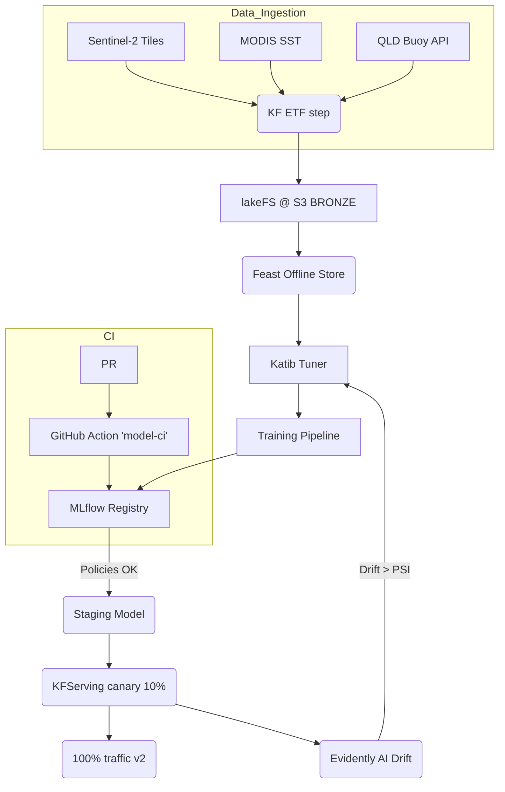

# ReefGuard AI Documentation

This guide expands on the project architecture, local development workflow, and common troubleshooting steps. It also collects diagrams referenced in the top level README for easier access.

## Architecture Overview

ReefGuard AI orchestrates ingestion, feature management, model training, registry, serving and monitoring for coral-bleaching risk prediction.



* **Ingestion** – satellite tiles and buoy readings land in lakeFS-backed object storage.
* **Feature Store** – Feast materialises features to Parquet and Redis.
* **Training & Tuning** – Kubeflow Pipelines invoke training jobs tuned by Katib.
* **Model Registry** – MLflow tracks experiments and governs stage transitions.
* **Serving** – KFServing or SageMaker deploy models with canary rollout.
* **Monitoring** – Evidently exports drift metrics to Prometheus and Grafana.

## Local Setup

1. Clone the repository and create an isolated environment.
   ```bash
   git clone https://github.com/example/Australian_ReefGuard-AI.git
   cd Australian_ReefGuard-AI
   python -m venv .venv && source .venv/bin/activate
   pip install -r requirements.txt
   ```
2. Launch local services for tracking and feature definitions.
   ```bash
   mlflow server --backend-store-uri sqlite:///mlflow.db --default-artifact-root ./mlruns &
   feast apply
   ```
3. Ingest sample data and run a training job.
   ```bash
   python pipelines/kfp_v2/etl_pipeline.py --local-sample
   python models/trainer/train.py --sample-data
   ```
4. Serve the latest model and query it.
   ```bash
   python models/inference/app.py --model-path models/artifacts/latest &
   curl -X POST -H "Content-Type: application/json" \
     -d '{"features": {"sst": 28.4, "turbidity": 3.1}}' \
     http://localhost:8000/predict
   ```

## Troubleshooting

| Symptom | Likely Cause | Fix |
| --- | --- | --- |
| `mlflow.exceptions.MlflowException: Permission` | MLflow ingress auth misconfigured | Ensure Cognito group `mlops-admins` attached |
| Katib trial pods stuck Pending | GPU quota exceeded | Adjust `nvidia.com/gpu: 0` for CPU trials or request quota |
| Feast online lookup timeout | Redis eviction | Increase memory or set LRU policy |
| KFServing 503 | Istio sidecar missing | Namespace not labeled `istio-injection=enabled` |
| Evidently service 500 | Missing numpy-rocm wheel | Rebuild image targeting GPU arch or use CPU mode |

## Diagrams

The end-to-end workflow diagram above mirrors the one in the project README. Grafana panels for drift, latency, and heat-map visualisations are defined in [`grafana_dash.json`](grafana_dash.json).
